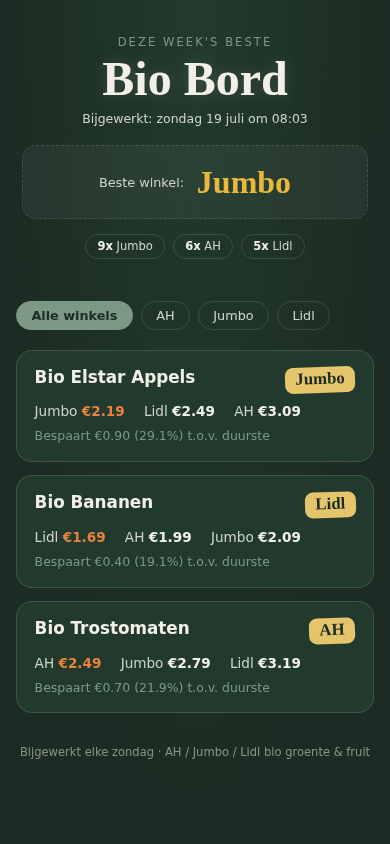

# Het Bio Lijstje — bio-aanbiedingen bij AH / Jumbo / Lidl / Aldi / Dirk / Plus / Ekoplaza



Toont wekelijks de lopende bio groente/fruit-aanbiedingen bij AH, Jumbo,
Lidl, Aldi, Dirk, Plus en Ekoplaza, per winkel naast elkaar in één overzicht
(geen tabs, geen klikken). Live te bekijken op
[janvdengel.github.io/Bio-lijstje](https://janvdengel.github.io/Bio-lijstje/).

Dit is de broncode, bedoeld om **zelf te draaien** — geen account, geen
centrale server, geen winstoogmerk. Iedereen host zijn eigen exemplaar op
zijn eigen Raspberry Pi. MIT-licentie: gebruik, verander en deel het zoals je
wilt.

Draait als een **losstaande Home Assistant OS add-on** (`hass_addon/`) op een
Raspberry Pi: geen sensor, geen dashboard-kaart, geen HACS — alleen de
Supervisor van HAOS die een eigen Docker-containertje met een cron-taak en
een simpele webserver voor je draaiend houdt. Dit is nodig omdat HAOS geen
`apt`, `systemd` voor eigen scripts of gewone crontab op de host heeft.

### Wat staat waar in deze repo

Deze repo bevat zowel de broncode als de gepubliceerde website, omdat die
website via GitHub Pages vanuit de repo-root wordt geserveerd:

- **Broncode** (met de hand aangepast): `fetch_bio_prices.py`, `hass_addon/`.
- **Website** (staat in de root, want GitHub Pages serveert vanaf `/`):
  `index.html`, `manifest.json`, `sw.js`, `icon.png`. Op de Pi horen deze
  vier in een `www/`-submap onder `/addons/bio_bord/`.
- **Data** (automatisch overschreven door de Pi, elke zondag):
  `data/bio_prices.json`.

De Pi pusht bij elke fetch alleen die laatste twee groepen terug naar deze
repo — de broncode wordt nooit door de Pi overschreven. Let er wel op dat
een wijziging aan `index.html` ook naar de Pi moet (zie hieronder), anders
zet de eerstvolgende push de oude versie terug.

## Vereisten

- Een Raspberry Pi (of andere machine) met **Home Assistant OS** (HAOS) —
  niet "kale" Raspberry Pi OS met Home Assistant Core erbovenop.
- SSH-toegang tot die Pi.

## Installatie

1. Zorg dat SSH-toegang tot de Pi werkt (Instellingen > Add-ons > "Terminal
   & SSH" add-on, `authorized_keys` met je public key).
2. Clone deze repo en kopieer de inhoud naar `/addons/bio_bord/` op de Pi.
   Let op dat de vier website-bestanden op de Pi in een `www/`-submap horen,
   terwijl ze in deze repo in de root staan (zie "Wat staat waar" hierboven):
   - `fetch_bio_prices.py` → `/addons/bio_bord/fetch_bio_prices.py`
   - `index.html`, `manifest.json`, `icon.png`, `sw.js` → `/addons/bio_bord/www/`
   - `hass_addon/config.yaml` → `/addons/bio_bord/config.yaml`
   - `hass_addon/Dockerfile` → `/addons/bio_bord/Dockerfile`
   - `hass_addon/run.sh` → `/addons/bio_bord/run.sh`
3. Op de Pi: `ha store reload && ha apps install local_bio_bord && ha apps start local_bio_bord`
4. Open `http://<pi-ip>:8099/` op je thuisnetwerk.

De add-on start automatisch bij een reboot van de Pi (`boot: auto`), en de
data (`bio_prices.json` + `geschiedenis.json`) staat persistent in
`/share/bio_bord/data/` op de Pi zelf (overleeft dus een rebuild/update van
de add-on). De webserver start meteen bij opstarten (met de laatst bekende
data) — de fetch draait daarna op de achtergrond, dus je hoeft niet te
wachten tot die klaar is voordat de pagina bereikbaar is.

Na een wijziging aan `fetch_bio_prices.py`, `Dockerfile` of één van de
website-bestanden: kopieer het bestand naar de Pi (website-bestanden naar
`/addons/bio_bord/www/`) en draai `ha apps rebuild local_bio_bord` (bij een
versiebump in `config.yaml`: `ha apps update local_bio_bord`) — een
`ha apps restart` is niet genoeg, dat herstart alleen de bestaande
container-image zonder de broncode opnieuw in te bouwen.

**Sla dat kopiëren naar de Pi niet over.** Een wijziging die alleen in deze
repo staat, wordt bij de eerstvolgende wekelijkse fetch overschreven door de
versie die de Pi nog heeft — die pusht namelijk zijn eigen kopie van de
website terug.

### Optioneel: ook publiek via GitHub Pages

Standaard is de pagina alleen bereikbaar op je thuisnetwerk
(`http://<pi-ip>:8099/`) — een lokaal IP-adres wordt sowieso nooit over het
publieke internet gerouteerd, ongeacht routerinstellingen. Wil je 'm delen
met iemand buiten je huis (zonder VPN-app of eigen Home Assistant-account
voor die persoon), dan kan de add-on na elke fetch ook automatisch naar een
GitHub-repo pushen die je zelf aan GitHub Pages koppelt, met jouw eigen token
en jouw eigen repo. Dat mag dezelfde repo zijn als deze (zo doet het
origineel het: de Pi overschrijft alleen de website- en databestanden, en
laat de broncode ongemoeid), of een aparte repo als je code en publicatie
liever gescheiden houdt:

1. Kies de doel-repo: deze repo zelf, of een nieuwe publieke repo
   (bv. `<jouw-gebruiker>/bio-lijstje`).
2. Maak een fine-grained Personal Access Token
   ([github.com/settings/tokens?type=beta](https://github.com/settings/tokens?type=beta)),
   met Repository access beperkt tot die ene repo, en Contents-permissie op
   "Read and write".
3. Zet de opties via de Supervisor-API (of via Instellingen > Add-ons >
   Het Bio Lijstje > Configuratie in de HA-UI, als die daar verschijnt):

   ```
   curl -X POST -H "Authorization: Bearer $SUPERVISOR_TOKEN" \
     -H "Content-Type: application/json" \
     -d '{"options":{"github_token":"<token>","github_repo":"<gebruiker>/<repo>"}}' \
     http://supervisor/addons/local_bio_bord/options
   ha apps restart local_bio_bord
   ```
4. Na de eerste geslaagde push: ga naar Settings > Pages van de repo, kies
   "Deploy from a branch" → branch `main`, folder `/ (root)` → Save.

Het token staat bewust niet in de broncode — het wordt gelezen uit
`/data/options.json` (de add-on's eigen, door Supervisor beheerde
optie-opslag) en als env var doorgegeven aan zowel de startup-fetch als de
wekelijkse cron-fetch (via `/etc/bio_bord_env.sh`, dat cron anders niet zou
zien — cron-jobs draaien met een kale omgeving).

## Testen

```
ha apps logs local_bio_bord
```

Handmatig opnieuw fetchen (bv. om te debuggen) — draait automatisch bij elke
herstart van de add-on, daarna elke zondag 08:00 via cron:

```
ha apps restart local_bio_bord
```

## Hoe de data tot stand komt

Per winkel worden twee bronnen gecombineerd en op naam gedupliceerd:

- **PrijsProfeet-API** (`prijsprofeet.nl/api`) — een gratis, sleutelloos
  JSON-endpoint dat 10 NL-supermarkten uniform ontsluit, producten al
  getagd met `dietary_tags` (o.a. `"bio"`). Snel (één request per winkel),
  maar bleek voor Lidl een merkbaar dunnere catalogus te hebben dan voor
  AH/Jumbo.
- **Folderz.nl** (reclamefolder-aggregator, gevonden via het open-source
  project [`nl-supermarkt-mcp`](https://github.com/Samvox1/nl-supermarkt-mcp)) —
  trager (scraping, pagineert door alle lopende acties per winkel), maar
  vult de gaten van PrijsProfeet op met een volledige doorzoeking.
  `robots.txt` staat dit toe voor gewone user-agents. Belangrijke bevinding
  tijdens het bouwen: `/robots.txt` zelf gaf een AWS WAF JavaScript-
  uitdaging (HTTP 202), maar de daadwerkelijke content-pagina's
  (`/winkels/<winkel>/aanbiedingen`) gaven gewoon HTTP 200 met een simpele
  `requests`-aanroep — geen headless browser nodig.

  **Alleen ingeschakeld voor Lidl.** Bij AH (~99 pagina's) en Jumbo (~36
  pagina's) leverde de volledige paginering vrijwel nooit iets op dat
  PrijsProfeet niet al had — puur tijd kosten (2-4 minuten) zonder
  toegevoegde waarde. Bij Lidl vult het wél een structurele blinde vlek:
  PrijsProfeet's Lidl-catalogus bleek merkbaar dunner. Dit bracht de
  totale fetch-tijd terug van ~3-5 minuten naar **~45 seconden**.

Beide bronnen filteren op: bevat "bio" als los woord, én matcht een
AGF-trefwoord (`AGF_KEYWORDS`). Woordgrenzen zijn bewust asymmetrisch: de
meeste keywords matchen als voorvoegsel (nodig voor Nederlandse
samenstellingen als "tomat**enpulp**", "appel**moes**"), maar een paar
korte, dubbelzinnige keywords ("ui", "uien", "kool") matchen alleen als heel
woord — anders zou "ui" ook binnen "inlegkru**ui**sjes" matchen, en "kool"
ook binnen "**kool**zuurhoudend" (allebei live gevonden tijdens testen).

**Aldi, Dirk, Plus en Ekoplaza** draaien alleen via PrijsProfeet (geen
Folderz-scraping nodig). Bij Ekoplaza is de "bio"-woordeis uitgeschakeld
(`vereist_bio_woord = False` in `AANBIEDINGEN_STORES`) — hun assortiment is al vrijwel volledig
biologisch, dus daar is alleen het AGF-keyword-filter nog nodig.

## Prijsgeschiedenis — "was ik genaaid?"

Elke fetch schrijft per product (per winkel) de datum + actieprijs +
normale_prijs weg naar `geschiedenis.json` (persistent, in
`/share/bio_bord/data/`, max. 30 records per product — ~7 maanden bij 1x
per week). Bij elke volgende fetch wordt de laagste ooit geziene prijs voor
dat product erbij gezet, **voordat** vandaag's prijs meetelt:

- Is de actieprijs van vandaag de laagste die ooit gezien is → 🏆-badge.
- Is 'm hoger dan een eerder geziene prijs → ⚠️-badge met de laagste prijs
  en datum. Dat betekent: de winkel claimt een "aanbieding" t.o.v. zijn
  eigen normale_prijs, maar je hebt dit product al eens goedkoper gezien
  (actie of niet) — een indicatie van opgeblazen referentieprijzen.

Werkt pas echt na een paar weken data — de eerste keer heeft nog niets om
mee te vergelijken. Zie `bio_prices.sample.json` voor een voorbeeld van het
dataformaat.

## Waarom geen winkelvergelijking (grootste prijsverschil)?

De oorspronkelijke opzet was één top-20 met het grootste prijsverschil
tussen AH/Jumbo/Lidl, en later een aparte "normale prijs"-lijst. Beide
bleken na live testen niet haalbaar:

- **Bio-aanbiedingen matchen tussen winkels is te schaars.** In een
  live-test matchte precies **1** van 1150 Lidl-acties het bio+AGF-filter.
  Een "grootste prijsverschil tussen acties"-top-20 zou dus vrijwel altijd
  leeg zijn — geen bug, gewoon te weinig overlap tussen winkels in
  eenzelfde week.
- **Een "normale" (niet-actie) prijs bestaat niet overal.** AH heeft een
  doorlopende prijscatalogus (via `supermarktconnector`), maar Jumbo's
  mobiele API wordt geblokkeerd door hun Akamai-botbescherming (zelfs
  vanaf een gewoon thuis-IP — een oneindige hang i.p.v. een nette 403,
  want de onderliggende `requests.get()`-call heeft geen timeout), en Lidl
  verkoopt verse groente/fruit/kruidenierswaren **structureel niet online**
  — elk bio-product op `/c/biologisch-assortiment/a10010999` toont
  `"Alleen in de winkel"`, `stockAvailability.onlineAvailable` staat overal
  op `false`. Een lijst die daardoor alleen AH's eigen data zou tonen, zou
  zich voordoen als een vergelijking terwijl het dat niet is — dat leek
  misleidend, dus is die feature geschrapt in plaats van half opgelost.

## Bekende beperkingen

- Bio-aanbiedingen zijn schaars: verwacht regelmatig 0-3 producten per
  winkel per week. Dat is de realiteit van "acties", niet een bug — de
  pagina toont dat dan ook expliciet ("Geen bio-acties bij X deze week").
- Folderz.nl toont actieprijzen (en de doorgestreepte oude prijs als
  referentie) — geen doorlopende "normale prijs" voor producten die niet
  toevallig deze week in de folder staan.
- Geen productmatching tussen winkels (bewust — zie hierboven).
- Prijsgeschiedenis vergelijkt op exacte productnaam per winkel — een
  kleine naamswijziging door de winkel (bv. andere verpakkingsgrootte in de
  titel) telt als een nieuw product zonder geschiedenis.

## Aanpassen

- `AGF_KEYWORDS` / `_AGF_WHOLE_WORD_ONLY`: welke producttypes meetellen als
  "groente/fruit", en welke daarvan alleen als heel woord mogen matchen.
- `AANBIEDINGEN_STORES`: welke winkels meedoen (PrijsProfeet-slug +
  Folderz-slug per winkel, of `None` om Folderz voor die winkel over te
  slaan).
- `FOLDERZ_MAX_PAGES`: veiligheidsgrens voor de Folderz-paginering.
- `HISTORY_MAX_PER_PRODUCT`: hoeveel weken geschiedenis per product bewaard
  blijft.
- Cron-tijd: in `hass_addon/Dockerfile`, de regel met
  `echo '0 8 * * 0 ...' > /etc/crontabs/root` (nu elke zondag 08:00).
- Poort: `hass_addon/config.yaml` (`ports:`, standaard 8099).
- Layout/kleuren per winkel: `STORE_COLORS` / `STORE_BADGES` in `index.html`
  (plus de bijbehorende `--<winkel>`-kleurvariabelen bovenaan de CSS).
- Hoeveel acties een winkel standaard toont voordat er een "meer tonen"-knop
  verschijnt: `STORE_VISIBLE_CAP` in `index.html`.

## Bijdragen

Issues en pull requests zijn welkom — vooral voor extra winkels, betere
matching, of ondersteuning voor niet-HAOS-omgevingen (kale Raspberry Pi OS,
Docker Compose, etc.).

## Licentie

MIT — zie [LICENSE](LICENSE). Gebruik, verander en deel dit zoals je wilt,
zonder garantie.
